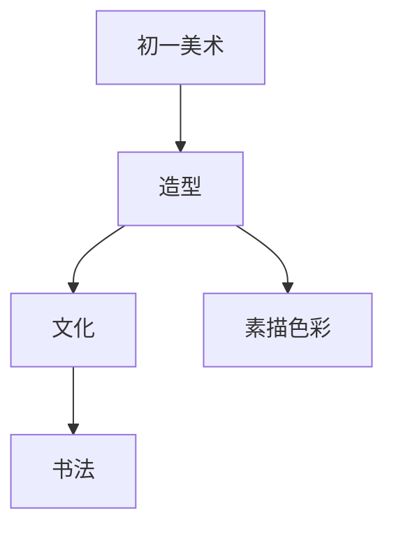

# 初一美术知识结构

## 知识体系总览

## 知识点列表

| 序号 | 知识点 | 核心目标 |
|------|--------|---------|
| 1 | [素描造型](./素描造型) | 学习石膏几何体素描，掌握明暗关系 |
| 2 | [色彩静物](./色彩静物) | 学习水彩或水粉的静物写生 |
| 3 | [书法入门](./书法入门) | 学习毛笔楷书基本笔画和结构 |

## 学习目标

- 学习石膏几何体素描，掌握明暗关系
- 学习水彩或水粉的静物写生
- 学习毛笔楷书基本笔画和结构
