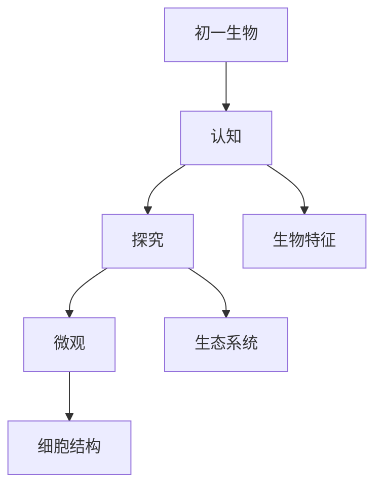

# 初一生物知识结构

## 知识体系总览

## 知识点列表

| 序号 | 知识点 | 核心目标 |
|------|--------|---------|
| 1 | [生物的特征](./生物的特征) | 认识生物的基本特征，区分生物与非生物 |
| 2 | [生态系统](./生态系统) | 理解生态系统的组成和食物链 |
| 3 | [细胞结构](./细胞结构) | 认识植物细胞和动物细胞的基本结构 |

## 学习目标

- 认识生物的基本特征，区分生物与非生物
- 理解生态系统的组成和食物链
- 认识植物细胞和动物细胞的基本结构
