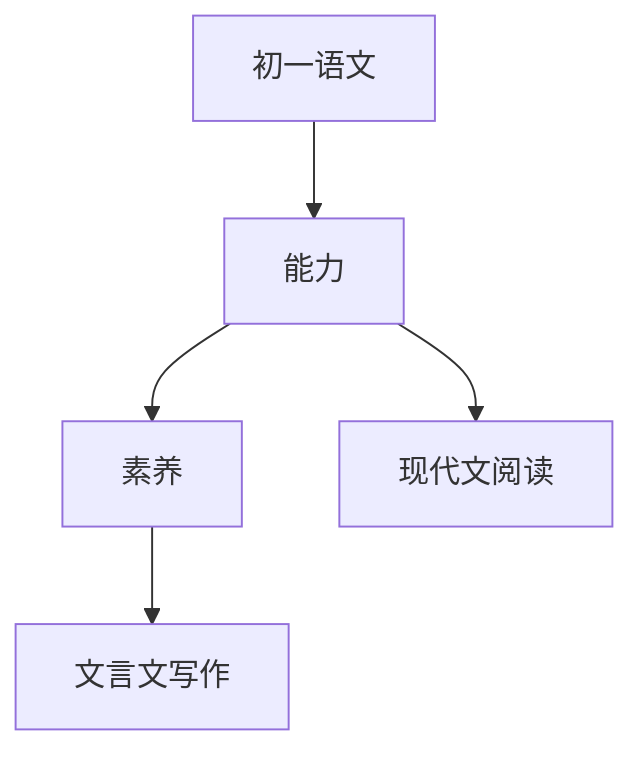

# 初一语文知识结构

## 知识体系总览

## 知识点列表

| 序号 | 知识点 | 核心目标 |
|------|--------|---------|
| 1 | [现代文阅读](./现代文阅读) | 学会分析记叙文说明文的写作手法 |
| 2 | [文言文阅读](./文言文阅读) | 掌握常见文言实词虚词，翻译浅易文言文 |
| 3 | [作文训练](./作文训练) | 学会写记叙文，做到内容具体、感情真挚 |
| 4 | [名著导读](./名著导读) | 阅读《朝花夕拾》《西游记》等名著 |

## 学习目标

- 学会分析记叙文说明文的写作手法
- 掌握常见文言实词虚词，翻译浅易文言文
- 学会写记叙文，做到内容具体、感情真挚
- 阅读《朝花夕拾》《西游记》等名著
