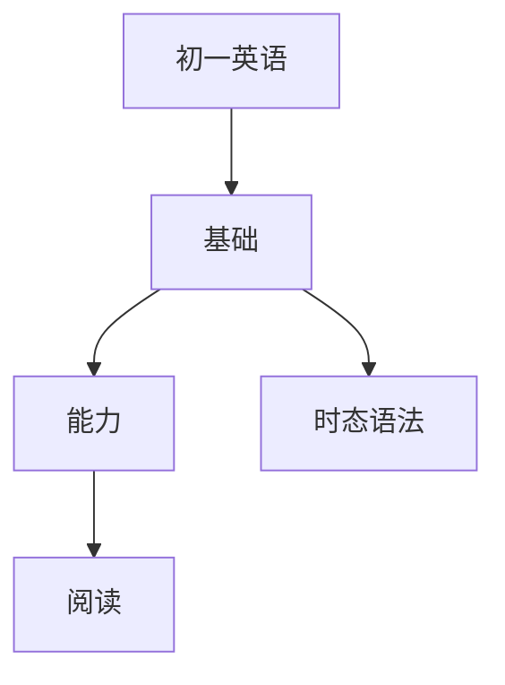

# 初一英语知识结构

## 知识体系总览

## 知识点列表

| 序号 | 知识点 | 核心目标 |
|------|--------|---------|
| 1 | [时态综合](./时态综合) | 掌握一般现在时、现在进行时、一般过去时 |
| 2 | [句型结构](./句型结构) | 掌握There be句型、祈使句、感叹句 |
| 3 | [阅读理解](./阅读理解) | 阅读100词左右的短文，理解主旨和细节 |

## 学习目标

- 掌握一般现在时、现在进行时、一般过去时
- 掌握There be句型、祈使句、感叹句
- 阅读100词左右的短文，理解主旨和细节
