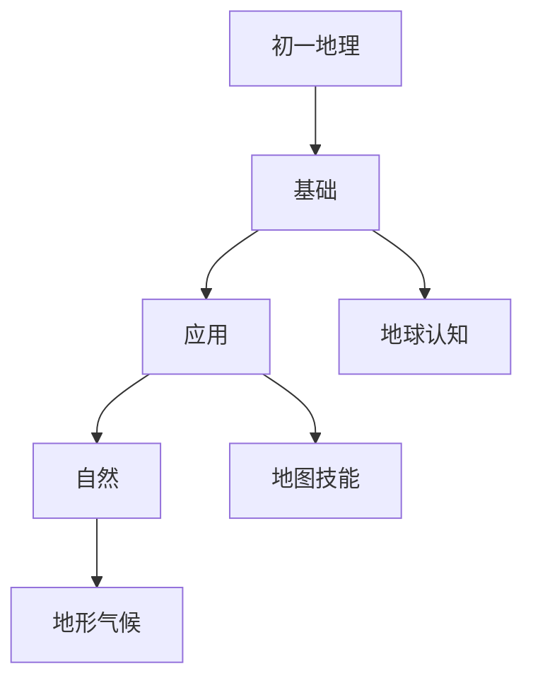

# 初一地理知识结构

## 知识体系总览

## 知识点列表

| 序号 | 知识点 | 核心目标 |
|------|--------|---------|
| 1 | [地球与地球仪](./地球与地球仪) | 认识地球的形状、经纬线和经纬度 |
| 2 | [地图的阅读](./地图的阅读) | 学会在地图上辨别方向、计算距离 |
| 3 | [地形与气候](./地形与气候) | 了解五种基本地形和世界主要气候类型 |

## 学习目标

- 认识地球的形状、经纬线和经纬度
- 学会在地图上辨别方向、计算距离
- 了解五种基本地形和世界主要气候类型
