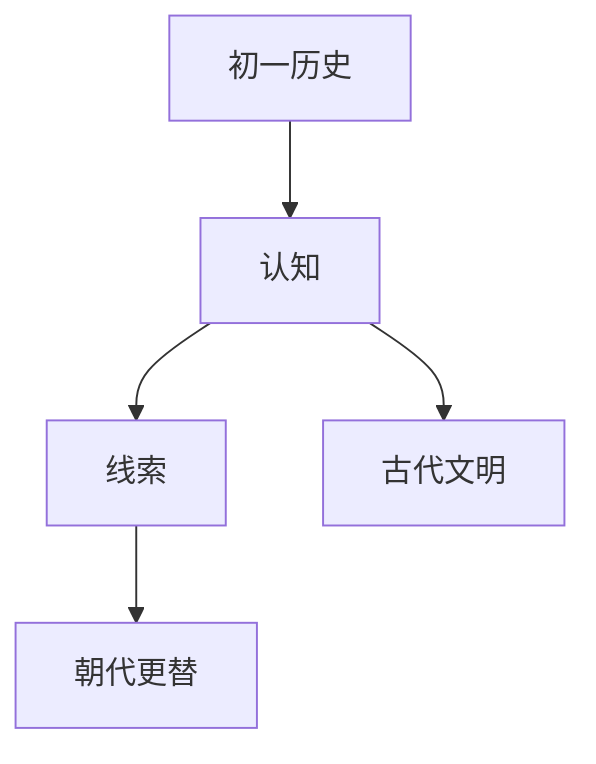

# 初一历史知识结构

## 知识体系总览

## 知识点列表

| 序号 | 知识点 | 核心目标 |
|------|--------|---------|
| 1 | [早期人类与文明](./早期人类与文明) | 了解北京人、河姆渡和半坡原始居民 |
| 2 | [夏商周三代](./夏商周三代) | 了解夏商周更替和青铜文明 |
| 3 | [秦汉统一](./秦汉统一) | 了解秦统一六国和汉武帝大一统 |

## 学习目标

- 了解北京人、河姆渡和半坡原始居民
- 了解夏商周更替和青铜文明
- 了解秦统一六国和汉武帝大一统
