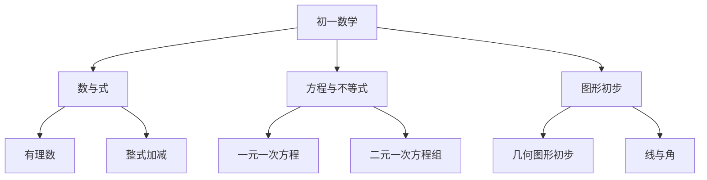

# 初一数学知识结构

## 知识体系总览

## 知识点列表

| 序号 | 知识点 | 核心目标 |
|------|--------|---------|
| 1 | [有理数](./有理数) | 掌握有理数运算，理解数轴和绝对值 |
| 2 | [整式加减](./整式加减) | 掌握合并同类项和去括号 |
| 3 | [一元一次方程](./一元一次方程) | 会解一元一次方程及应用 |

## 学习目标

- 建立有理数体系，掌握正负数运算
- 理解代数式的概念，会整式加减
- 掌握一元一次方程的解法和应用