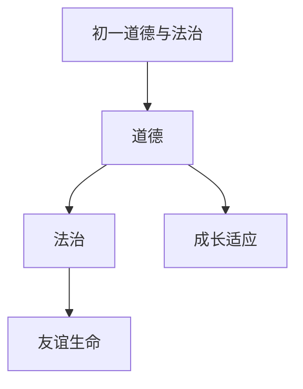

# 初一道德与法治知识结构

## 知识体系总览

## 知识点列表

| 序号 | 知识点 | 核心目标 |
|------|--------|---------|
| 1 | [成长的节拍](./成长的节拍) | 认识中学时代的意义，学会适应新环境 |
| 2 | [友谊与交往](./友谊与交往) | 认识友谊的力量，学会与同学老师交往 |
| 3 | [生命的思考](./生命的思考) | 认识生命的独特性，敬畏生命 |

## 学习目标

- 认识中学时代的意义，学会适应新环境
- 认识友谊的力量，学会与同学老师交往
- 认识生命的独特性，敬畏生命
