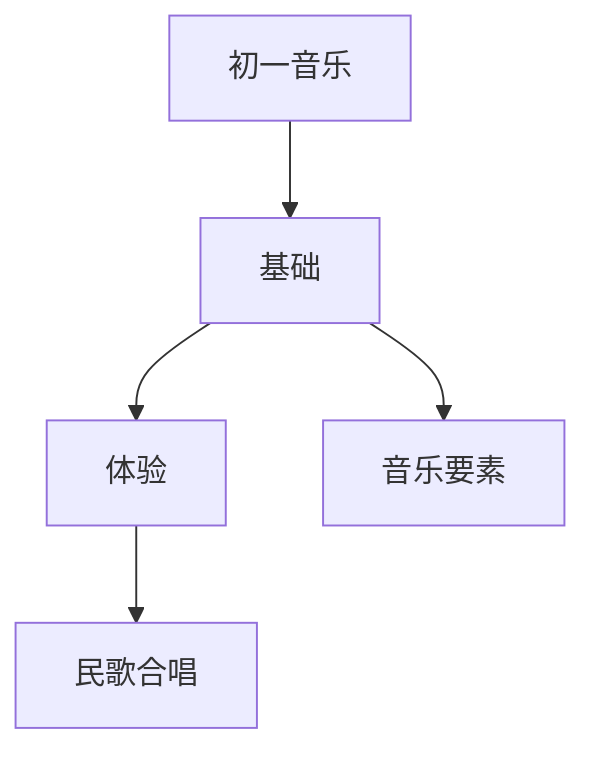

# 初一音乐知识结构

## 知识体系总览

## 知识点列表

| 序号 | 知识点 | 核心目标 |
|------|--------|---------|
| 1 | [音乐要素](./音乐要素) | 理解旋律、节奏、和声、音色等音乐要素 |
| 2 | [中国民歌](./中国民歌) | 了解山歌、小调、号子等民歌体裁 |

## 学习目标

- 理解旋律、节奏、和声、音色等音乐要素
- 了解山歌、小调、号子等民歌体裁
