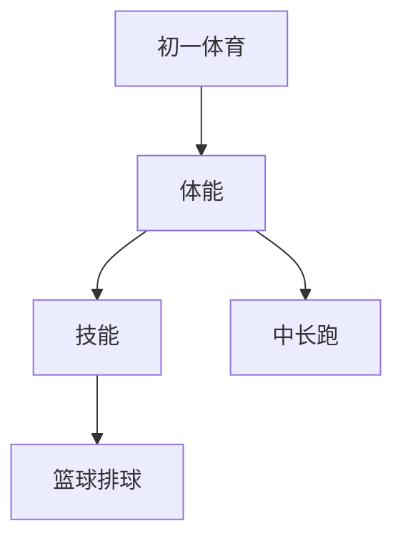

# 初一体育知识结构

## 知识体系总览

## 知识点列表

| 序号 | 知识点 | 核心目标 |
|------|--------|---------|
| 1 | [800米/1000米跑](./800米-1000米跑) | 掌握中长跑技术，提高心肺耐力 |
| 2 | [篮球技术](./篮球技术) | 学习行进间运球、传接球和三步上篮 |
| 3 | [排球基础](./排球基础) | 学习垫球、传球等基本技术 |

## 学习目标

- 掌握中长跑技术，提高心肺耐力
- 学习行进间运球、传接球和三步上篮
- 学习垫球、传球等基本技术
