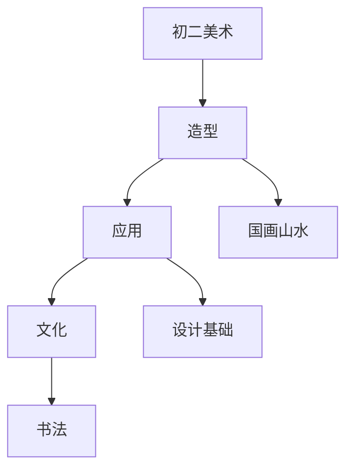

# 初二美术知识结构

## 知识体系总览

## 知识点列表

| 序号 | 知识点 | 核心目标 |
|------|--------|---------|
| 1 | [中国画山水](./中国画山水) | 学习山水画的基本技法和构图 |
| 2 | [设计基础](./设计基础) | 了解平面构成、色彩构成的基本原理 |
| 3 | [书法进阶](./书法进阶) | 学习楷书的结构规律和章法 |

## 学习目标

- 学习山水画的基本技法和构图
- 了解平面构成、色彩构成的基本原理
- 学习楷书的结构规律和章法
