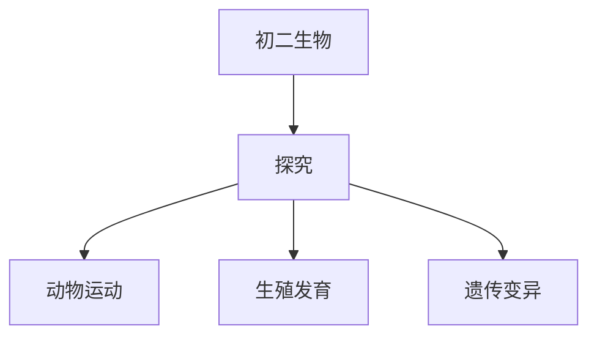

# 初二生物知识结构

## 知识体系总览

## 知识点列表

| 序号 | 知识点 | 核心目标 |
|------|--------|---------|
| 1 | [动物的运动与行为](./动物的运动与行为) | 了解动物运动系统的结构和行为类型 |
| 2 | [生物的生殖与发育](./生物的生殖与发育) | 了解植物的有性生殖和动物的发育过程 |
| 3 | [遗传与变异](./遗传与变异) | 了解基因、DNA和染色体，认识遗传变异现象 |

## 学习目标

- 了解动物运动系统的结构和行为类型
- 了解植物的有性生殖和动物的发育过程
- 了解基因、DNA和染色体，认识遗传变异现象
