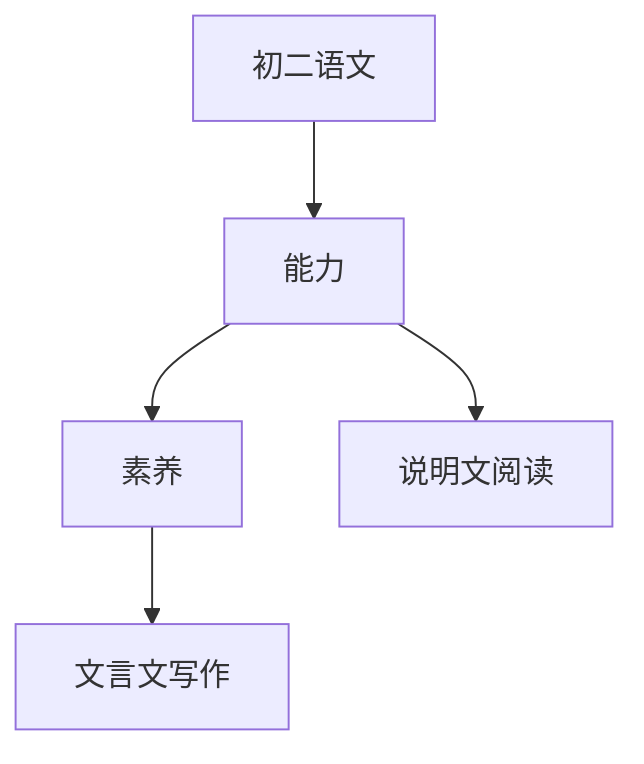

# 初二语文知识结构

## 知识体系总览

## 知识点列表

| 序号 | 知识点 | 核心目标 |
|------|--------|---------|
| 1 | [说明文阅读](./说明文阅读) | 掌握说明方法说明顺序，分析说明文 |
| 2 | [文言文进阶](./文言文进阶) | 阅读《桃花源记》《小石潭记》等篇目 |
| 3 | [写作训练](./写作训练) | 学会写说明文和简单的议论文 |
| 4 | [名著导读](./名著导读) | 阅读《红星照耀中国》《昆虫记》等 |

## 学习目标

- 掌握说明方法说明顺序，分析说明文
- 阅读《桃花源记》《小石潭记》等篇目
- 学会写说明文和简单的议论文
- 阅读《红星照耀中国》《昆虫记》等
