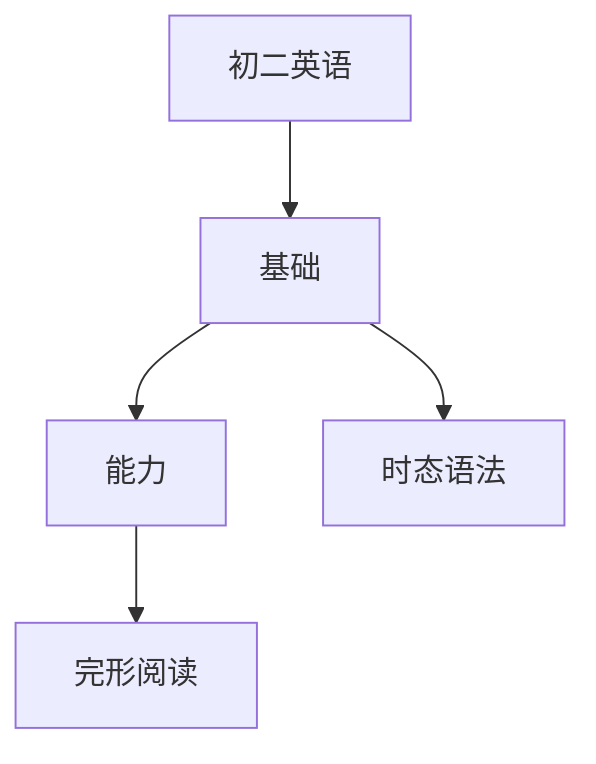

# 初二英语知识结构

## 知识体系总览

## 知识点列表

| 序号 | 知识点 | 核心目标 |
|------|--------|---------|
| 1 | [过去进行时](./过去进行时) | 掌握过去进行时的结构和用法 |
| 2 | [形容词副词比较级](./形容词副词比较级) | 系统掌握比较级和最高级 |
| 3 | [完形填空与阅读](./完形填空与阅读) | 提高阅读理解能力和完形填空技巧 |

## 学习目标

- 掌握过去进行时的结构和用法
- 系统掌握比较级和最高级
- 提高阅读理解能力和完形填空技巧
