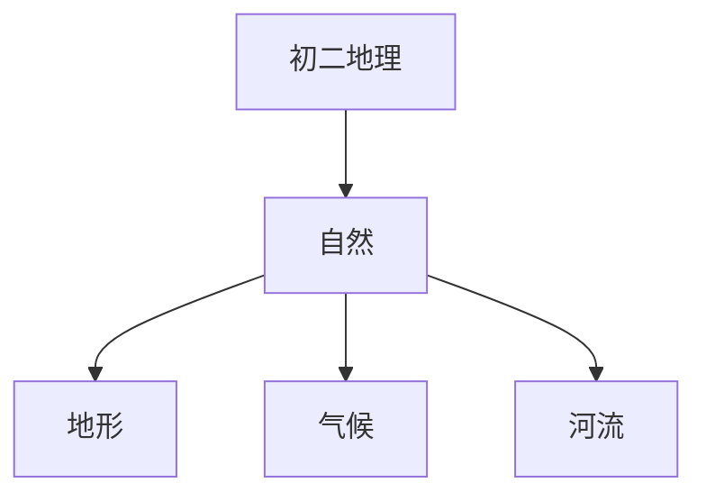

# 初二地理知识结构

## 知识体系总览

## 知识点列表

| 序号 | 知识点 | 核心目标 |
|------|--------|---------|
| 1 | [中国的地形](./中国的地形) | 了解中国地势三级阶梯和主要地形区 |
| 2 | [中国的气候](./中国的气候) | 了解中国气候特征和主要气候类型 |
| 3 | [中国的河流](./中国的河流) | 了解长江、黄河等主要河流的水文特征 |

## 学习目标

- 了解中国地势三级阶梯和主要地形区
- 了解中国气候特征和主要气候类型
- 了解长江、黄河等主要河流的水文特征
