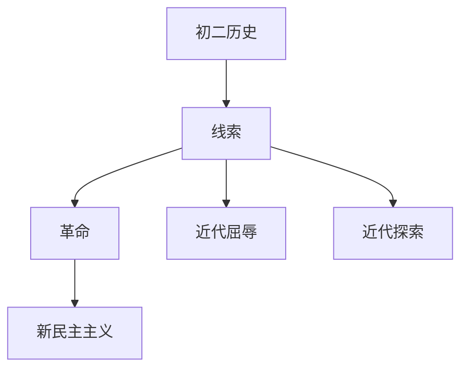

# 初二历史知识结构

## 知识体系总览

## 知识点列表

| 序号 | 知识点 | 核心目标 |
|------|--------|---------|
| 1 | [近代列强侵略](./近代列强侵略) | 了解鸦片战争、甲午战争等近代屈辱史 |
| 2 | [近代化探索](./近代化探索) | 了解洋务运动、戊戌变法、辛亥革命 |
| 3 | [新民主主义革命](./新民主主义革命) | 了解五四运动、中共成立和抗日战争 |

## 学习目标

- 了解鸦片战争、甲午战争等近代屈辱史
- 了解洋务运动、戊戌变法、辛亥革命
- 了解五四运动、中共成立和抗日战争
