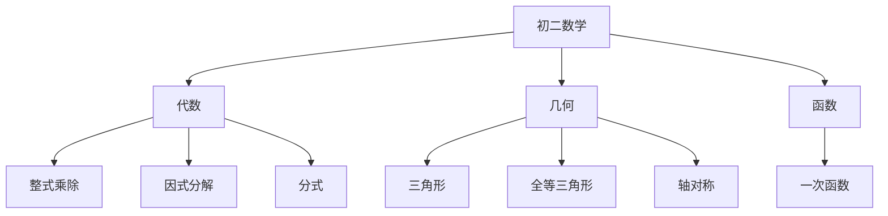

# 初二数学知识结构

## 知识体系总览

## 知识点列表

| 序号 | 知识点 | 核心目标 |
|------|--------|---------|
| 1 | [三角形](./三角形) | 掌握三角形性质和分类 |
| 2 | [全等三角形](./全等三角形) | 掌握全等判定与证明 |
| 3 | [一次函数](./一次函数) | 理解函数概念，掌握一次函数图像 |

## 学习目标

- 掌握整式乘除和因式分解
- 掌握全等三角形的判定和证明
- 理解函数概念，掌握一次函数性质