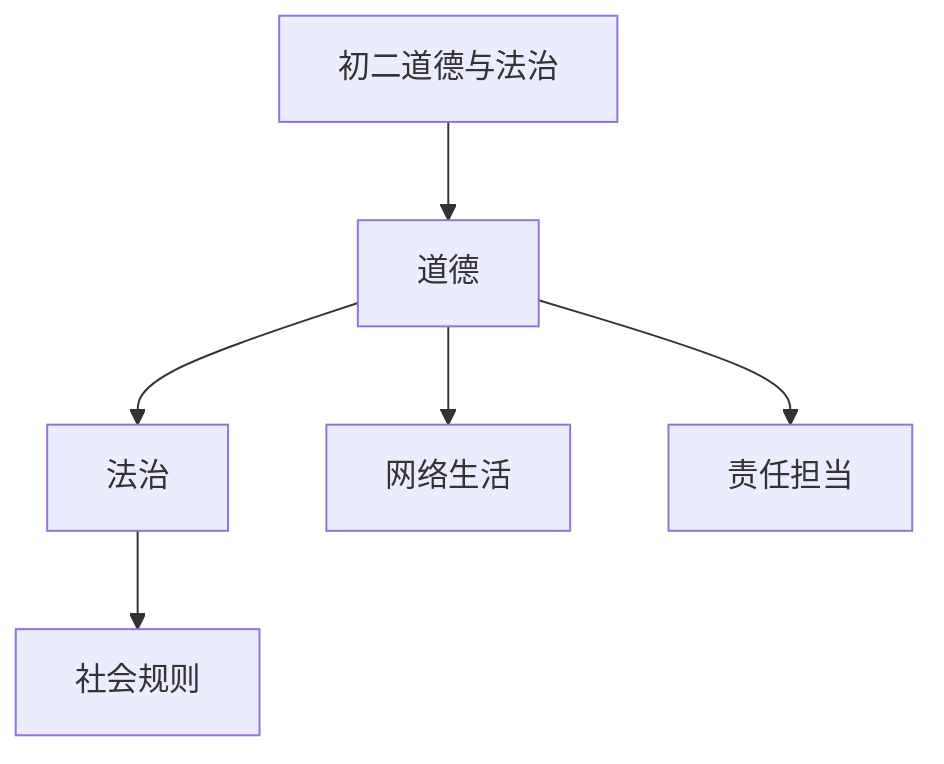

# 初二道德与法治知识结构

## 知识体系总览

## 知识点列表

| 序号 | 知识点 | 核心目标 |
|------|--------|---------|
| 1 | [网络生活新空间](./网络生活新空间) | 理性参与网络生活，防范网络风险 |
| 2 | [遵守社会规则](./遵守社会规则) | 理解自由与规则的关系，做守法公民 |
| 3 | [责任与担当](./责任与担当) | 认识角色与责任，学会承担责任 |

## 学习目标

- 理性参与网络生活，防范网络风险
- 理解自由与规则的关系，做守法公民
- 认识角色与责任，学会承担责任
