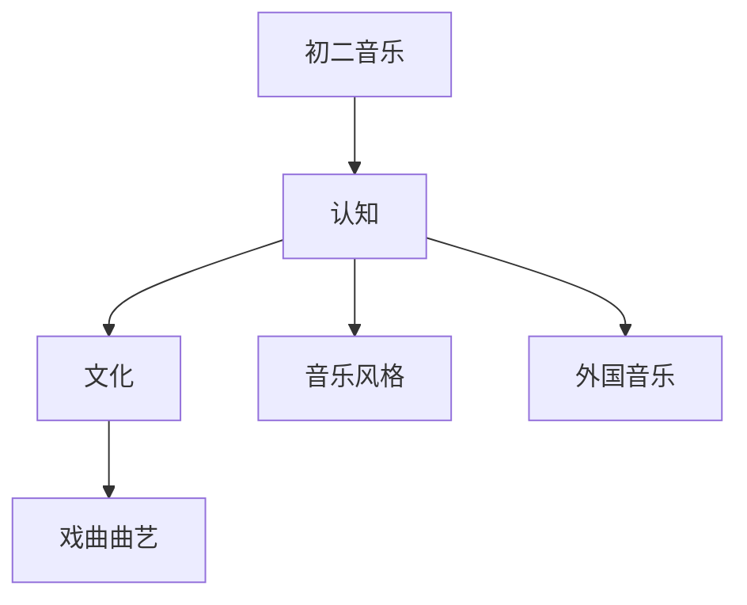

# 初二音乐知识结构

## 知识体系总览

## 知识点列表

| 序号 | 知识点 | 核心目标 |
|------|--------|---------|
| 1 | [音乐风格](./音乐风格) | 了解古典、民族、流行等音乐风格 |
| 2 | [外国音乐](./外国音乐) | 了解西方音乐史各时期代表人物和作品 |

## 学习目标

- 了解古典、民族、流行等音乐风格
- 了解西方音乐史各时期代表人物和作品
