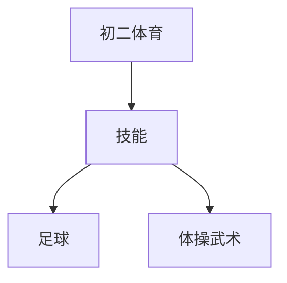

# 初二体育知识结构

## 知识体系总览

## 知识点列表

| 序号 | 知识点 | 核心目标 |
|------|--------|---------|
| 1 | [足球技术](./足球技术) | 学习运球过人、射门和简单战术配合 |
| 2 | [体操技巧](./体操技巧) | 学习肩肘倒立、头手倒立等技巧动作 |
| 3 | [武术套路](./武术套路) | 学习少年拳或初级长拳完整套路 |

## 学习目标

- 学习运球过人、射门和简单战术配合
- 学习肩肘倒立、头手倒立等技巧动作
- 学习少年拳或初级长拳完整套路
