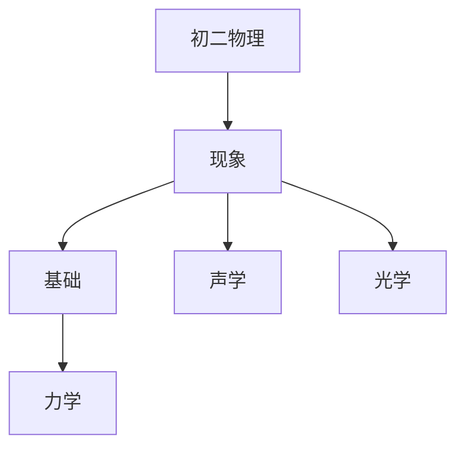

# 初二物理知识结构

## 知识体系总览

## 知识点列表

| 序号 | 知识点 | 核心目标 |
|------|--------|---------|
| 1 | [声现象](./声现象) | 了解声音的产生与传播，声音的特性 |
| 2 | [光现象](./光现象) | 了解光的直线传播、反射、折射规律 |
| 3 | [运动和力](./运动和力) | 理解速度、牛顿第一定律、二力平衡 |

## 学习目标

- 了解声音的产生与传播，声音的特性
- 了解光的直线传播、反射、折射规律
- 理解速度、牛顿第一定律、二力平衡
