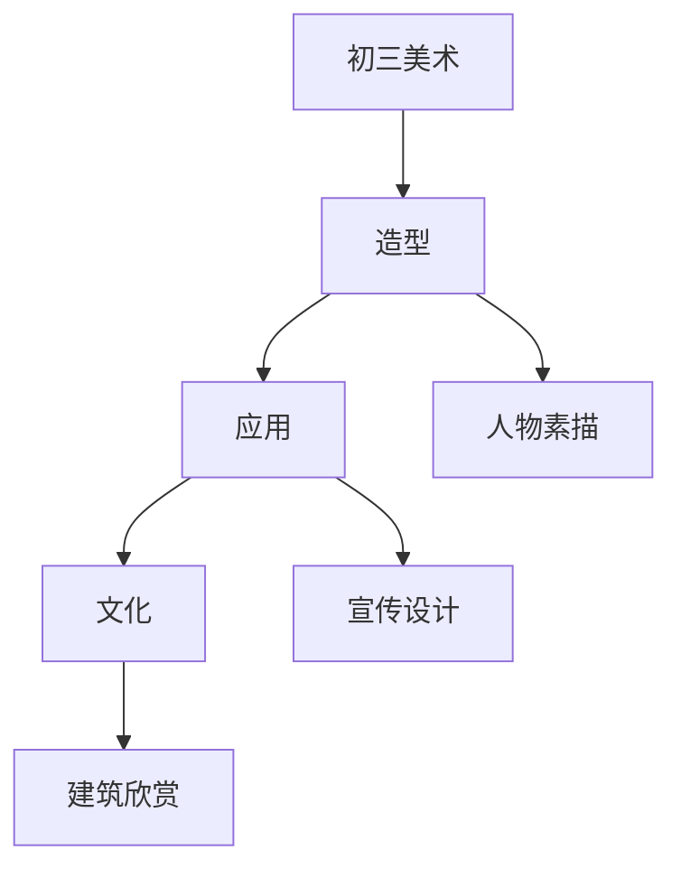

# 初三美术知识结构

## 知识体系总览

## 知识点列表

| 序号 | 知识点 | 核心目标 |
|------|--------|---------|
| 1 | [人物素描](./人物素描) | 学习人物头像的比例和结构 |
| 2 | [宣传设计](./宣传设计) | 学习海报、招贴画的设计与制作 |
| 3 | [建筑艺术欣赏](./建筑艺术欣赏) | 了解中外经典建筑的艺术特征 |

## 学习目标

- 学习人物头像的比例和结构
- 学习海报、招贴画的设计与制作
- 了解中外经典建筑的艺术特征
