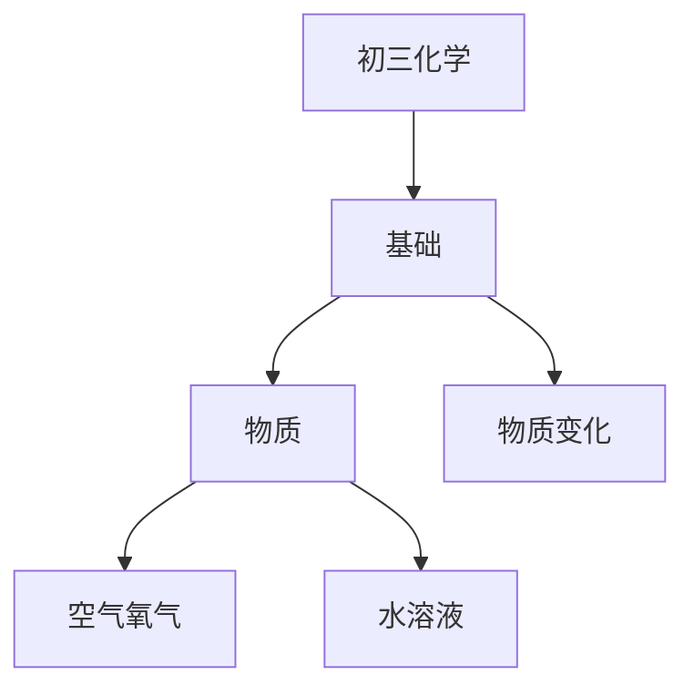

# 初三化学知识结构

## 知识体系总览

## 知识点列表

| 序号 | 知识点 | 核心目标 |
|------|--------|---------|
| 1 | [物质的变化](./物质的变化) | 理解物理变化和化学变化，认识化学性质 |
| 2 | [空气与氧气](./空气与氧气) | 了解空气成分，掌握氧气的制取和性质 |
| 3 | [水与溶液](./水与溶液) | 了解水的组成，理解溶液的概念和溶解度 |

## 学习目标

- 理解物理变化和化学变化，认识化学性质
- 了解空气成分，掌握氧气的制取和性质
- 了解水的组成，理解溶液的概念和溶解度
