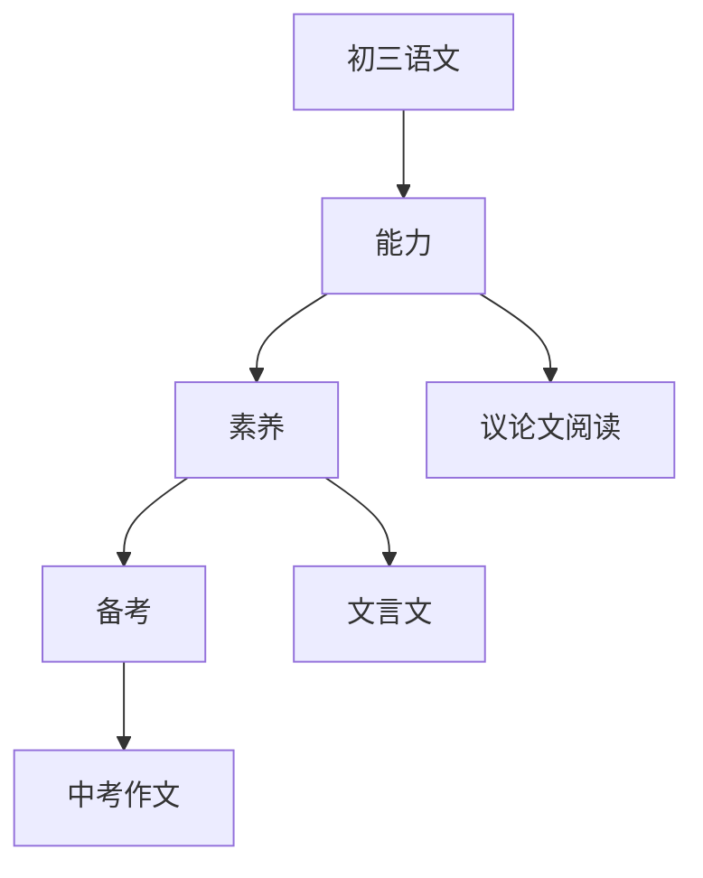

# 初三语文知识结构

## 知识体系总览

## 知识点列表

| 序号 | 知识点 | 核心目标 |
|------|--------|---------|
| 1 | [议论文阅读](./议论文阅读) | 掌握论点、论据、论证方法 |
| 2 | [文言文阅读](./文言文阅读) | 阅读《岳阳楼记》《醉翁亭记》等经典篇目 |
| 3 | [中考作文](./中考作文) | 掌握记叙文议论文的中考写作技巧 |
| 4 | [名著导读](./名著导读) | 阅读《水浒传》《简爱》等中外名著 |

## 学习目标

- 掌握论点、论据、论证方法
- 阅读《岳阳楼记》《醉翁亭记》等经典篇目
- 掌握记叙文议论文的中考写作技巧
- 阅读《水浒传》《简爱》等中外名著
