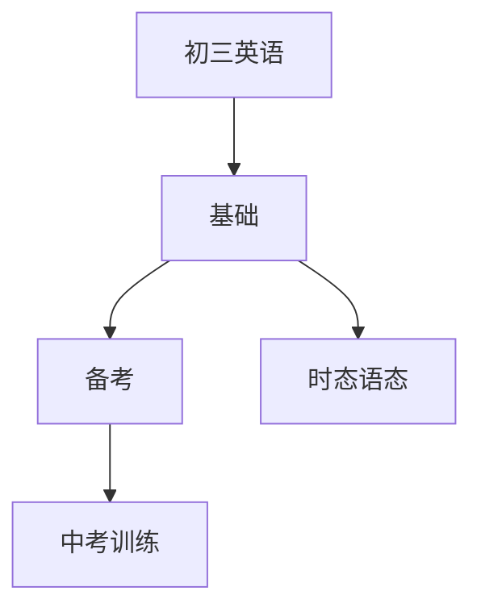

# 初三英语知识结构

## 知识体系总览

## 知识点列表

| 序号 | 知识点 | 核心目标 |
|------|--------|---------|
| 1 | [现在完成时](./现在完成时) | 掌握现在完成时的结构和用法 |
| 2 | [被动语态](./被动语态) | 理解并运用各种时态的被动语态 |
| 3 | [中考综合训练](./中考综合训练) | 阅读理解、完形、写作综合训练 |

## 学习目标

- 掌握现在完成时的结构和用法
- 理解并运用各种时态的被动语态
- 阅读理解、完形、写作综合训练
