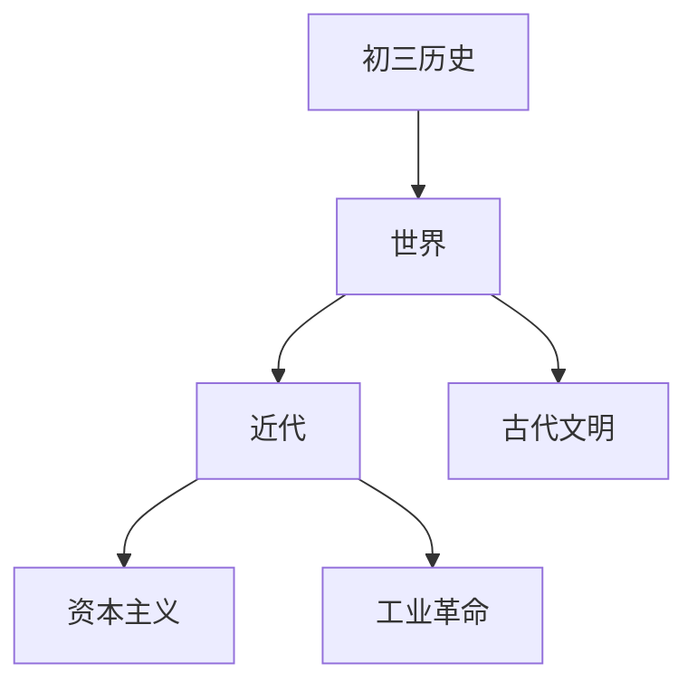

# 初三历史知识结构

## 知识体系总览

## 知识点列表

| 序号 | 知识点 | 核心目标 |
|------|--------|---------|
| 1 | [世界古代文明](./世界古代文明) | 了解古埃及古巴比伦古印度古希腊罗马 |
| 2 | [资本主义兴起](./资本主义兴起) | 了解文艺复兴新航路开辟和资产阶级革命 |
| 3 | [工业革命](./工业革命) | 了解两次工业革命的影响和马克思主义诞生 |

## 学习目标

- 了解古埃及古巴比伦古印度古希腊罗马
- 了解文艺复兴新航路开辟和资产阶级革命
- 了解两次工业革命的影响和马克思主义诞生
