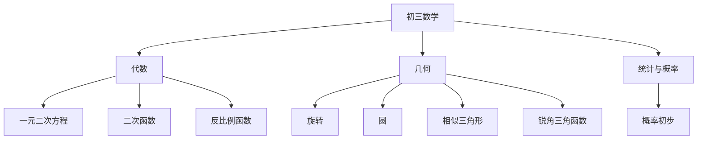

# 初三数学知识结构

## 知识体系总览

## 知识点列表

| 序号 | 知识点 | 核心目标 |
|------|--------|---------|
| 1 | [二次函数](./二次函数) | 掌握图像、性质和应用 |
| 2 | [圆](./圆) | 掌握圆的性质和位置关系 |
| 3 | [相似三角形](./相似三角形) | 掌握相似判定和比例 |

## 学习目标

- 掌握二次函数的图像和性质
- 理解圆的相关定理
- 掌握相似三角形和锐角三角函数
- 综合运用所学知识解决中考压轴题