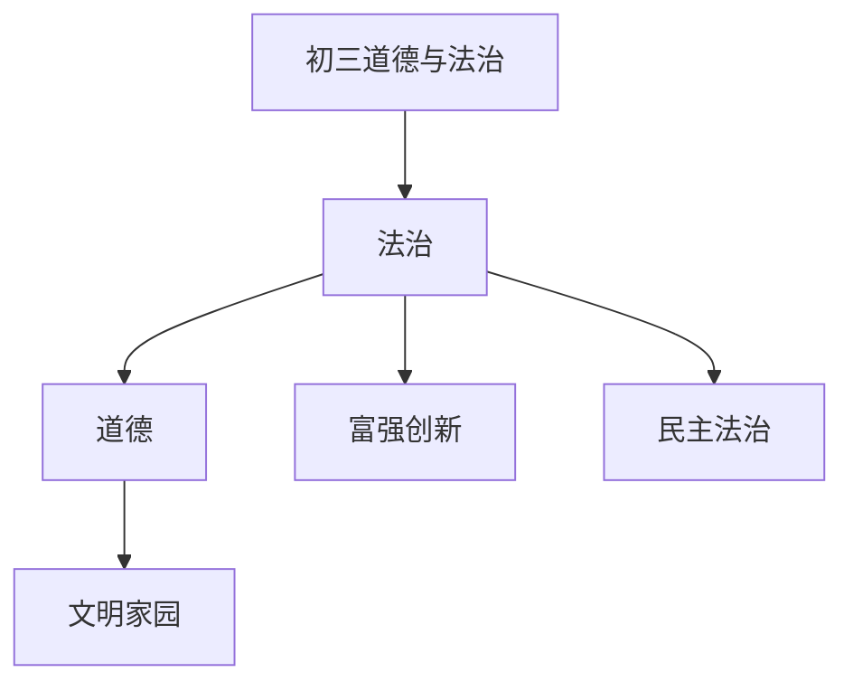

# 初三道德与法治知识结构

## 知识体系总览

## 知识点列表

| 序号 | 知识点 | 核心目标 |
|------|--------|---------|
| 1 | [富强与创新](./富强与创新) | 理解改革开放的意义，认识创新的重要性 |
| 2 | [民主与法治](./民主与法治) | 了解社会主义民主和全面依法治国 |
| 3 | [文明与家园](./文明与家园) | 传承中华文化，建设美丽中国 |

## 学习目标

- 理解改革开放的意义，认识创新的重要性
- 了解社会主义民主和全面依法治国
- 传承中华文化，建设美丽中国
