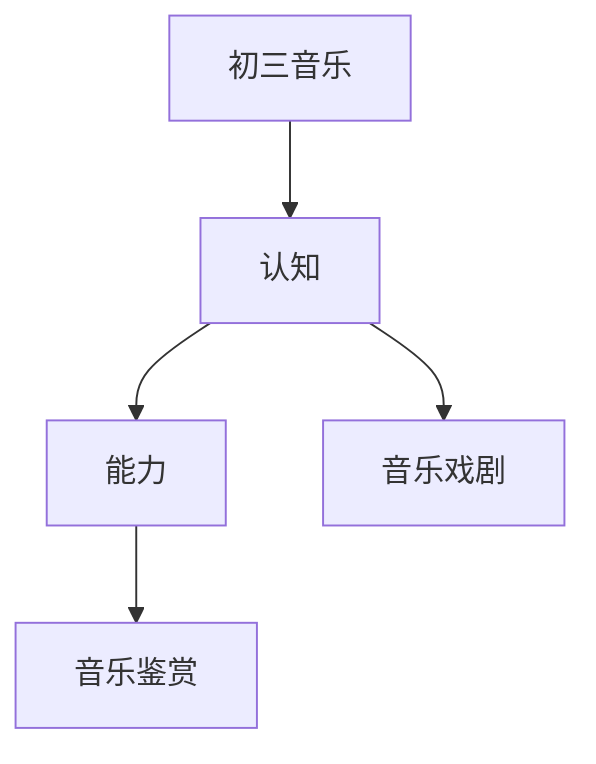

# 初三音乐知识结构

## 知识体系总览

## 知识点列表

| 序号 | 知识点 | 核心目标 |
|------|--------|---------|
| 1 | [音乐与戏剧](./音乐与戏剧) | 了解歌剧、音乐剧等综合性艺术形式 |
| 2 | [音乐鉴赏](./音乐鉴赏) | 掌握音乐鉴赏的基本方法，撰写听后感 |

## 学习目标

- 了解歌剧、音乐剧等综合性艺术形式
- 掌握音乐鉴赏的基本方法，撰写听后感
