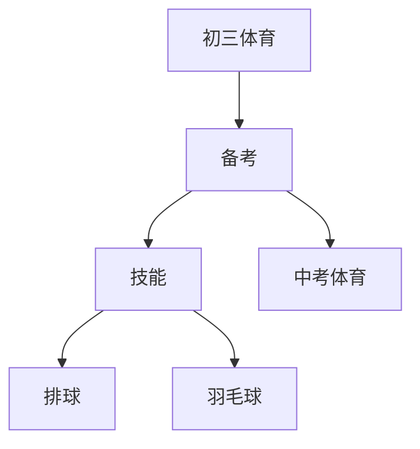

# 初三体育知识结构

## 知识体系总览

## 知识点列表

| 序号 | 知识点 | 核心目标 |
|------|--------|---------|
| 1 | [中考体育训练](./中考体育训练) | 针对中考项目进行专项训练 |
| 2 | [排球进阶](./排球进阶) | 学习发球、扣球和简单战术配合 |
| 3 | [羽毛球](./羽毛球) | 学习发球、高远球、扣杀等基本技术 |

## 学习目标

- 针对中考项目进行专项训练
- 学习发球、扣球和简单战术配合
- 学习发球、高远球、扣杀等基本技术
