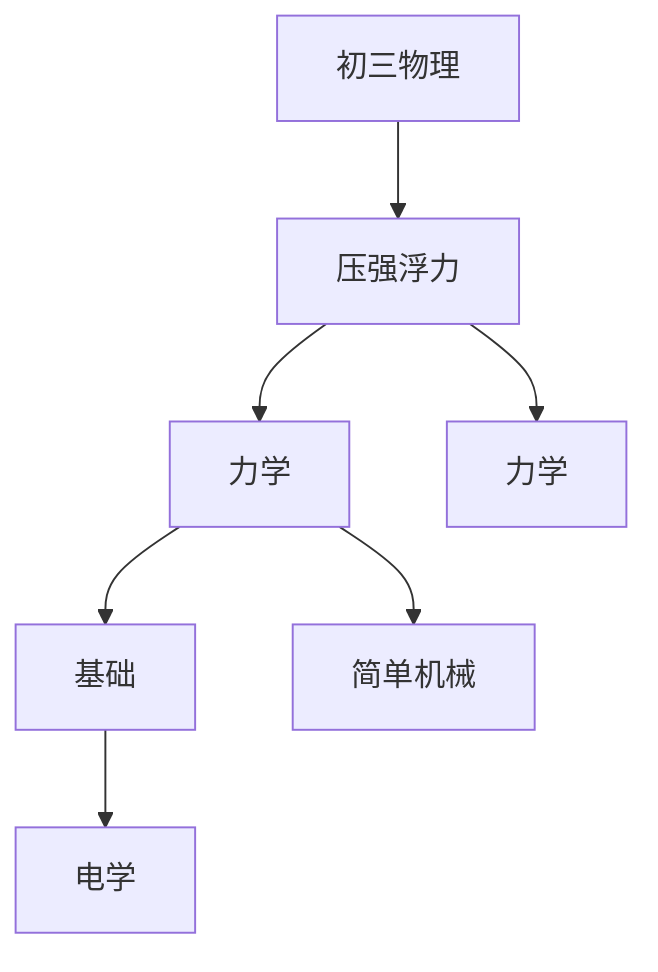

# 初三物理知识结构

## 知识体系总览

## 知识点列表

| 序号 | 知识点 | 核心目标 |
|------|--------|---------|
| 1 | [压强与浮力](./压强与浮力) | 掌握压强公式和阿基米德原理 |
| 2 | [简单机械](./简单机械) | 掌握杠杆平衡条件和滑轮组的计算 |
| 3 | [电学基础](./电学基础) | 了解欧姆定律、串并联电路的特点 |

## 学习目标

- 掌握压强公式和阿基米德原理
- 掌握杠杆平衡条件和滑轮组的计算
- 了解欧姆定律、串并联电路的特点
