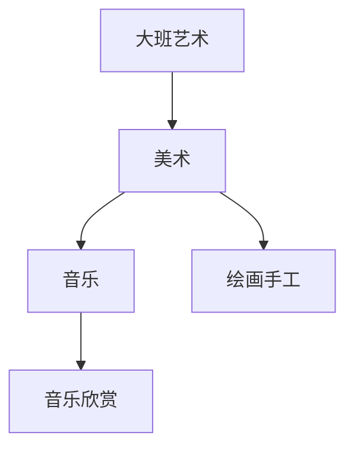

# 大班艺术知识结构

## 知识体系总览

## 知识点列表

| 序号 | 知识点 | 核心目标 |
|------|--------|---------|
| 1 | [主题绘画](./主题绘画) | 能围绕主题进行有内容的绘画创作 |
| 2 | [手工制作](./手工制作) | 利用废旧材料制作简单手工作品 |
| 3 | [音乐欣赏与表演](./音乐欣赏与表演) | 欣赏不同风格音乐，尝试简单表演 |

## 学习目标

- 能围绕主题进行有内容的绘画创作
- 利用废旧材料制作简单手工作品
- 欣赏不同风格音乐，尝试简单表演
