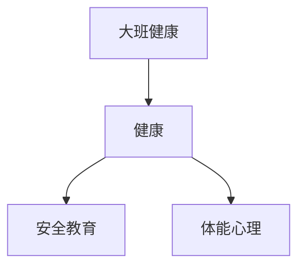

# 大班健康知识结构

## 知识体系总览

## 知识点列表

| 序号 | 知识点 | 核心目标 |
|------|--------|---------|
| 1 | [自我保护](./自我保护) | 知道基本的安全知识和求助方法 |
| 2 | [体能锻炼](./体能锻炼) | 练习跳绳、拍球等运动技能 |
| 3 | [作息与心理](./作息与心理) | 养成规律作息，学会调节情绪 |

## 学习目标

- 知道基本的安全知识和求助方法
- 练习跳绳、拍球等运动技能
- 养成规律作息，学会调节情绪
