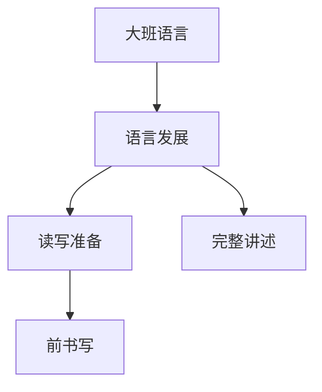

# 大班语言知识结构

## 知识体系总览

## 知识点列表

| 序号 | 知识点 | 核心目标 |
|------|--------|---------|
| 1 | [完整讲述](./完整讲述) | 能有序、连贯地讲述一件事 |
| 2 | [前书写准备](./前书写准备) | 练习正确握笔姿势，写自己的名字 |
| 3 | [前识字准备](./前识字准备) | 认识生活中常见的汉字标志 |

## 学习目标

- 能有序、连贯地讲述一件事
- 练习正确握笔姿势，写自己的名字
- 认识生活中常见的汉字标志
