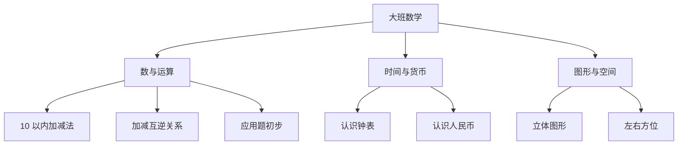

# 大班数学知识结构

## 知识体系总览

## 知识点列表

| 序号 | 知识点 | 核心目标 |
|------|--------|---------|
| 1 | [10 以内加减法](./10以内加减法) | 熟练口算 10 以内加减法 |
| 2 | [认识钟表](./认识钟表) | 能认读整点和半点 |
| 3 | [认识人民币](./认识人民币) | 认识元角分，会简单换算 |

## 学习目标

- 熟练进行 10 以内加减口算
- 建立初步的时间观念和货币概念
- 为小学数学学习做好衔接准备