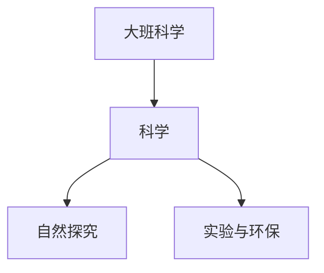

# 大班科学知识结构

## 知识体系总览

## 知识点列表

| 序号 | 知识点 | 核心目标 |
|------|--------|---------|
| 1 | [自然现象](./自然现象) | 了解风雨雷电等自然现象及成因 |
| 2 | [简单实验](./简单实验) | 尝试简单的科学小实验，记录发现 |
| 3 | [环保意识](./环保意识) | 了解垃圾分类，爱护动植物 |

## 学习目标

- 了解风雨雷电等自然现象及成因
- 尝试简单的科学小实验，记录发现
- 了解垃圾分类，爱护动植物
