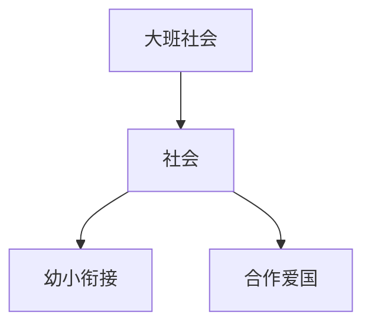

# 大班社会知识结构

## 知识体系总览

## 知识点列表

| 序号 | 知识点 | 核心目标 |
|------|--------|---------|
| 1 | [幼小衔接](./幼小衔接) | 了解小学环境，建立入学期待 |
| 2 | [合作与解决冲突](./合作与解决冲突) | 学习与同伴协商合作解决问题 |
| 3 | [爱国与家乡](./爱国与家乡) | 认识国旗国徽，了解家乡特色 |

## 学习目标

- 了解小学环境，建立入学期待
- 学习与同伴协商合作解决问题
- 认识国旗国徽，了解家乡特色
