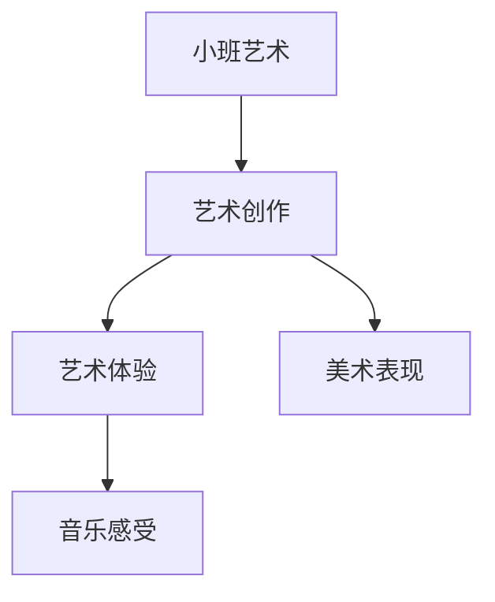

# 小班艺术知识结构

## 知识体系总览

## 知识点列表

| 序号 | 知识点 | 核心目标 |
|------|--------|---------|
| 1 | [涂鸦与色彩](./涂鸦与色彩) | 用蜡笔水彩自由涂画，认识基本颜色 |
| 2 | [撕纸与粘贴](./撕纸与粘贴) | 练习撕纸粘贴，锻炼手部精细动作 |
| 3 | [律动与歌唱](./律动与歌唱) | 随音乐自由律动，学唱简短歌曲 |

## 学习目标

- 用蜡笔水彩自由涂画，认识基本颜色
- 练习撕纸粘贴，锻炼手部精细动作
- 随音乐自由律动，学唱简短歌曲
