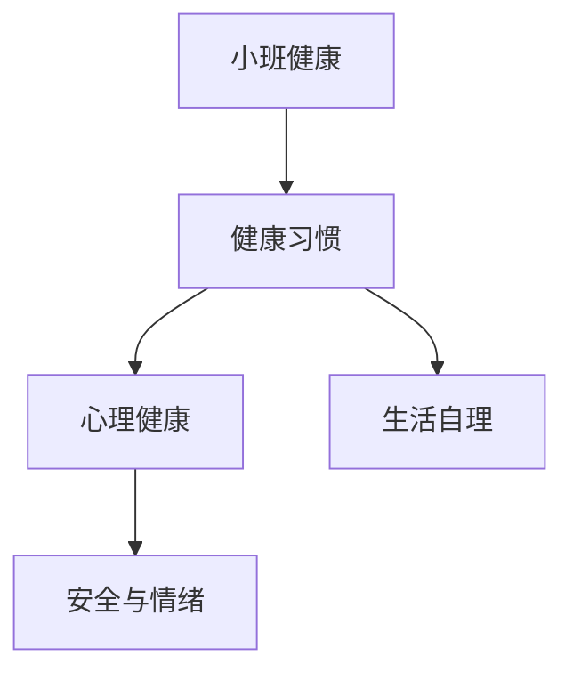

# 小班健康知识结构

## 知识体系总览

## 知识点列表

| 序号 | 知识点 | 核心目标 |
|------|--------|---------|
| 1 | [生活自理](./生活自理) | 学习自己穿衣、吃饭、如厕 |
| 2 | [安全常识](./安全常识) | 知道不跟陌生人走，不碰危险物品 |
| 3 | [情绪认知](./情绪认知) | 认识高兴、生气、伤心等基本情绪 |

## 学习目标

- 学习自己穿衣、吃饭、如厕
- 知道不跟陌生人走，不碰危险物品
- 认识高兴、生气、伤心等基本情绪
