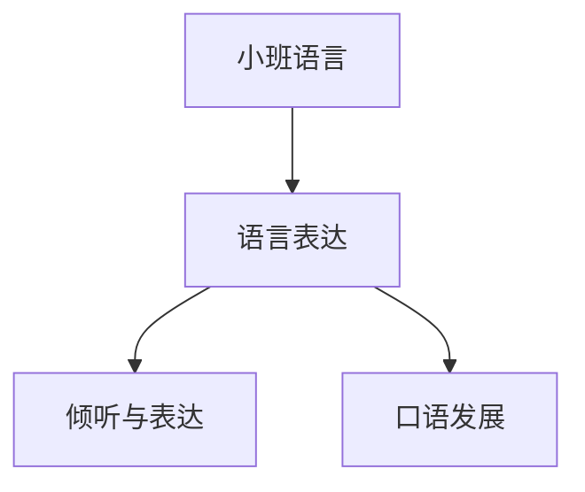

# 小班语言知识结构

## 知识体系总览

## 知识点列表

| 序号 | 知识点 | 核心目标 |
|------|--------|---------|
| 1 | [倾听与表达](./倾听与表达) | 能安静听故事，愿意用语言表达需求 |
| 2 | [儿歌与童谣](./儿歌与童谣) | 跟读简短儿歌，感受语言韵律 |
| 3 | [绘本阅读](./绘本阅读) | 能一页一页翻书，理解简单画面 |

## 学习目标

- 能安静听故事，愿意用语言表达需求
- 跟读简短儿歌，感受语言韵律
- 能一页一页翻书，理解简单画面
