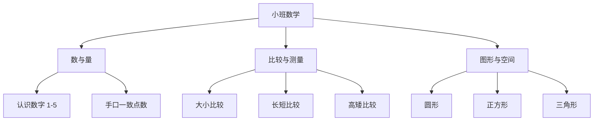

# 小班数学知识结构

## 知识体系总览

## 知识点列表

| 序号 | 知识点 | 核心目标 |
|------|--------|---------|
| 1 | [认识数字 1-5](./认识数字1-5) | 能认读数字 1-5，理解数的实际意义 |
| 2 | [大小比较](./大小比较) | 能用目测和重叠法比较大小 |
| 3 | [形状认知](./形状认知) | 能辨认和命名常见平面图形 |

## 学习目标

- 能手口一致地点数 5 以内的物体
- 能按物体的大小、长短等特征进行简单分类
- 对周围环境中的形状产生兴趣