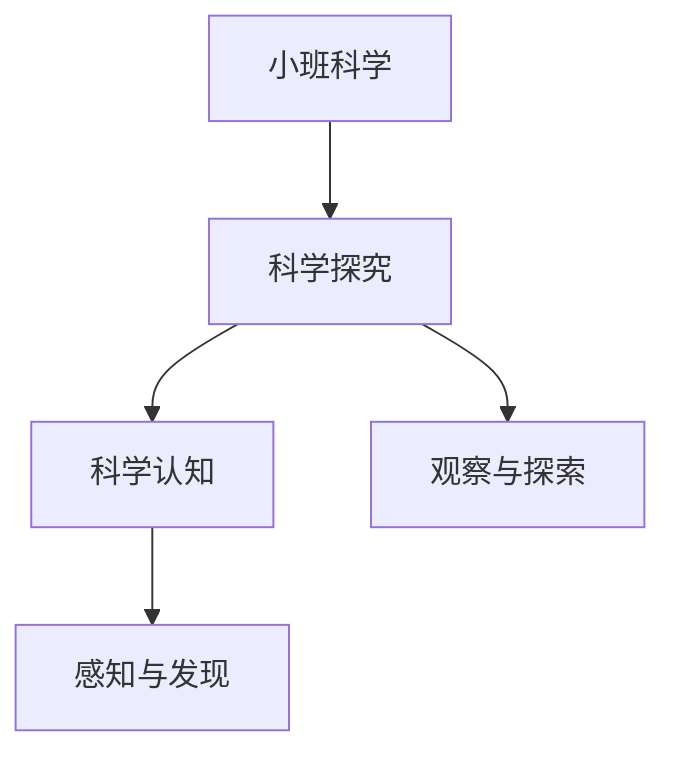

# 小班科学知识结构

## 知识体系总览

## 知识点列表

| 序号 | 知识点 | 核心目标 |
|------|--------|---------|
| 1 | [观察动植物](./观察动植物) | 认识常见动植物，了解基本特征 |
| 2 | [感官探索](./感官探索) | 用眼耳鼻舌手感知物体特性 |
| 3 | [天气与季节](./天气与季节) | 感知晴雨冷热，认识四季变化 |

## 学习目标

- 认识常见动植物，了解基本特征
- 用眼耳鼻舌手感知物体特性
- 感知晴雨冷热，认识四季变化
