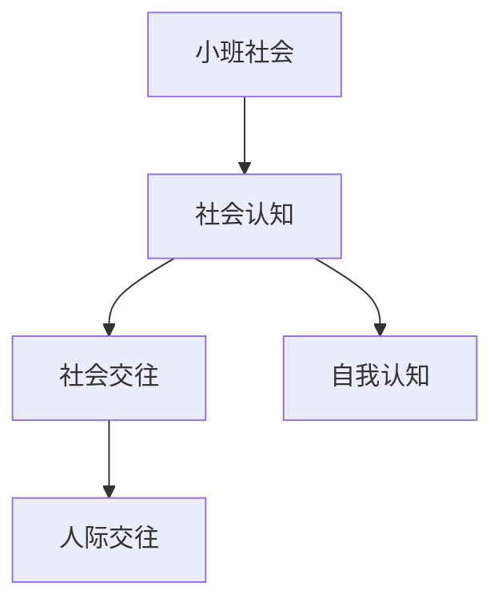

# 小班社会知识结构

## 知识体系总览

## 知识点列表

| 序号 | 知识点 | 核心目标 |
|------|--------|---------|
| 1 | [认识自己](./认识自己) | 知道自己的名字、性别、班级 |
| 2 | [礼貌用语](./礼貌用语) | 学会说你好、谢谢、对不起 |
| 3 | [同伴交往](./同伴交往) | 愿意和小朋友一起玩，学习分享 |

## 学习目标

- 知道自己的名字、性别、班级
- 学会说你好、谢谢、对不起
- 愿意和小朋友一起玩，学习分享
