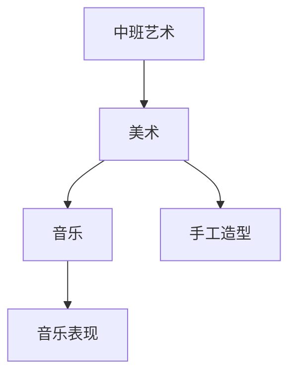

# 中班艺术知识结构

## 知识体系总览

## 知识点列表

| 序号 | 知识点 | 核心目标 |
|------|--------|---------|
| 1 | [折纸与泥工](./折纸与泥工) | 学折简单造型，用橡皮泥塑形 |
| 2 | [色彩搭配](./色彩搭配) | 认识冷暖色，尝试色彩搭配 |
| 3 | [音乐游戏](./音乐游戏) | 随音乐节奏做动作，区分快慢强弱 |

## 学习目标

- 学折简单造型，用橡皮泥塑形
- 认识冷暖色，尝试色彩搭配
- 随音乐节奏做动作，区分快慢强弱
