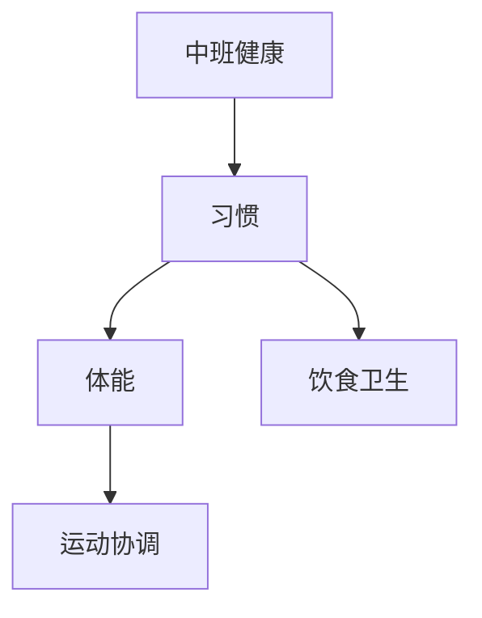

# 中班健康知识结构

## 知识体系总览

## 知识点列表

| 序号 | 知识点 | 核心目标 |
|------|--------|---------|
| 1 | [饮食与营养](./饮食与营养) | 认识常见食物，不挑食偏食 |
| 2 | [运动与协调](./运动与协调) | 练习跑跳钻爬，发展大肌肉动作 |
| 3 | [卫生习惯](./卫生习惯) | 养成饭前便后洗手等良好习惯 |

## 学习目标

- 认识常见食物，不挑食偏食
- 练习跑跳钻爬，发展大肌肉动作
- 养成饭前便后洗手等良好习惯
