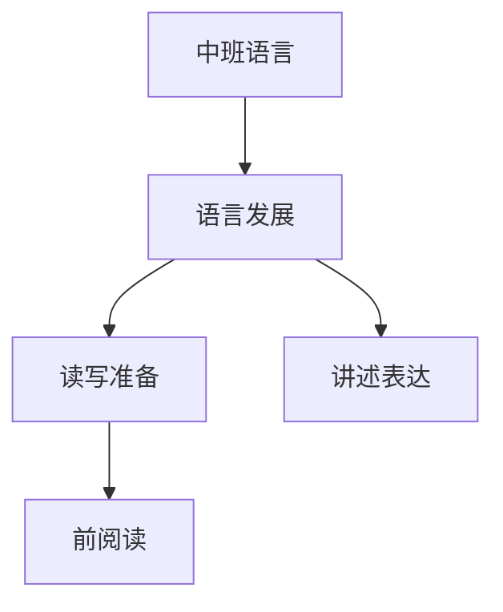

# 中班语言知识结构

## 知识体系总览

## 知识点列表

| 序号 | 知识点 | 核心目标 |
|------|--------|---------|
| 1 | [讲述与表达](./讲述与表达) | 能较完整地讲述简单事件 |
| 2 | [儿歌创编](./儿歌创编) | 学唱儿歌，尝试仿编简单儿歌 |
| 3 | [前阅读准备](./前阅读准备) | 理解图画书内容，能预测情节发展 |

## 学习目标

- 能较完整地讲述简单事件
- 学唱儿歌，尝试仿编简单儿歌
- 理解图画书内容，能预测情节发展
