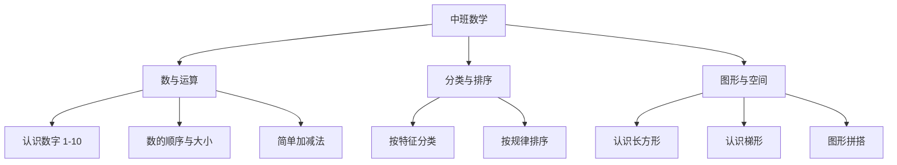

# 中班数学知识结构

## 知识体系总览

## 知识点列表

| 序号 | 知识点 | 核心目标 |
|------|--------|---------|
| 1 | [认识数字 1-10](./认识数字1-10) | 能正数和倒数 1-10，理解相邻数 |
| 2 | [简单加减法](./简单加减法) | 借助实物进行 5 以内加减运算 |
| 3 | [分类与排序](./分类与排序) | 能按颜色、大小、形状等特征分类 |

## 学习目标

- 理解 10 以内数的实际意义和顺序
- 能进行 5 以内的加减运算
- 能发现简单的排列规律（如 ABAB 模式）