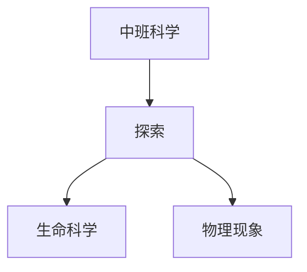

# 中班科学知识结构

## 知识体系总览

## 知识点列表

| 序号 | 知识点 | 核心目标 |
|------|--------|---------|
| 1 | [动植物生长](./动植物生长) | 观察种子发芽、蚕宝宝成长等 |
| 2 | [沉浮与磁力](./沉浮与磁力) | 探索物体的沉浮现象和磁铁吸铁 |
| 3 | [声音与光影](./声音与光影) | 感知不同声音，玩影子游戏 |

## 学习目标

- 观察种子发芽、蚕宝宝成长等
- 探索物体的沉浮现象和磁铁吸铁
- 感知不同声音，玩影子游戏
