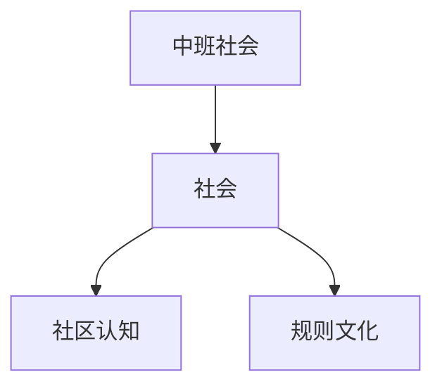

# 中班社会知识结构

## 知识体系总览

## 知识点列表

| 序号 | 知识点 | 核心目标 |
|------|--------|---------|
| 1 | [家庭与社区](./家庭与社区) | 了解家庭成员角色，认识社区环境 |
| 2 | [规则意识](./规则意识) | 理解排队、轮流等基本规则 |
| 3 | [节日文化](./节日文化) | 了解春节、中秋等传统节日习俗 |

## 学习目标

- 了解家庭成员角色，认识社区环境
- 理解排队、轮流等基本规则
- 了解春节、中秋等传统节日习俗
