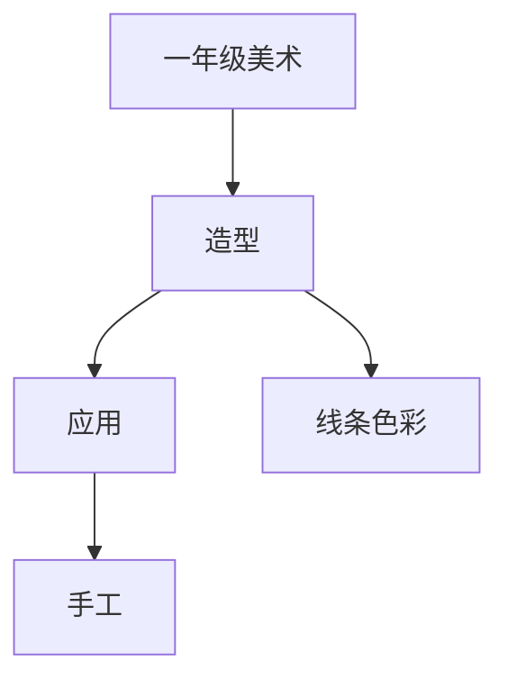

# 一年级美术知识结构

## 知识体系总览

## 知识点列表

| 序号 | 知识点 | 核心目标 |
|------|--------|---------|
| 1 | [线条与形状](./线条与形状) | 认识基本线条和形状，用线条表现事物 |
| 2 | [色彩认知](./色彩认知) | 认识三原色，学习平涂法 |
| 3 | [手工造型](./手工造型) | 学习撕、剪、贴、折等基本手工技能 |

## 学习目标

- 认识基本线条和形状，用线条表现事物
- 认识三原色，学习平涂法
- 学习撕、剪、贴、折等基本手工技能
